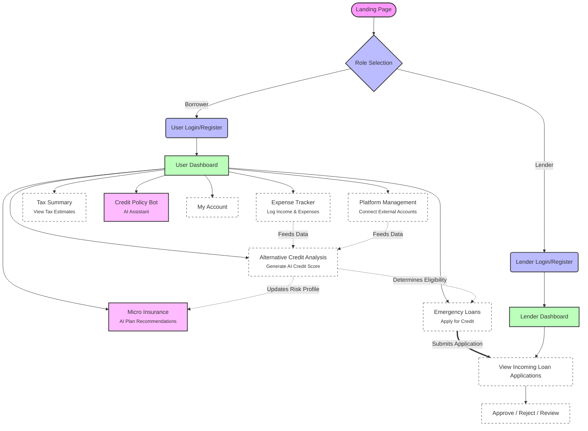

# 🚀 CreditFlow: Alternative Credit Scoring & Financial Platform

CreditFlow is a modern, full-stack financial application designed to provide alternative credit scoring for individuals (such as gig workers) lacking traditional credit histories. By leveraging users' income, expenses, and platform connections, CreditFlow uses AI to score creditworthiness, recommend micro-insurance, and facilitate emergency loans.

**Live Demo:** [https://alternative-credit-scoring.onrender.com/](https://alternative-credit-scoring.onrender.com/)

---

## 🏗️ Project Architecture & Scope

The application is structured as a robust microservices-inspired monorepo consisting of three distinct modules:

1. **`frontend`** (React, Vite, TailwindCSS)
   - The user-facing application providing interactive dashboards for both Borrowers and Lenders.
2. **`backend`** (Node.js, Express, MongoDB)
   - The primary REST API managing users, authentication, financial records, loan applications, and core business logic.
3. **`insurance-ai`** (Python, FastAPI, Groq/LLaMA 3)
   - An intelligent microservice that analyzes user risk profiles to recommend tailored micro-insurance products.

---

## 🧭 System Workflow & Service Graph

The following diagram illustrates the complete user journey and available services from the moment of logging in:



---

## ✨ Features & Functionality

### 👤 For Users (Borrowers)
- **Authentication**: Secure JWT-based Login & Registration (Multi-language support included).
- **Expense Tracker**: Log daily income and expenses. Visual charts to monitor cash flow.
- **Platform Management**: Connect gig-economy or external platform accounts to gather reliable income proof.
- **Alternative Credit Analysis**: An advanced scoring system that bypasses CIBIL scores by analyzing app-based financial behavior, platform earnings, and expenses.
- **Micro Insurance (AI-Powered)**: Uses the `insurance-ai` microservice to analyze a user's risk score and employment type to recommend the best insurance paths logically.
- **Tax Summary**: Automated snapshots of estimated tax liabilities based on logged income.
- **Emergency Loans**: Seamlessly apply for short-term emergency loans if the Alternative Credit Score passes the threshold.
- **Credit Policy Bot**: A responsive chatbot embedded on protected routes capable of answering questions about financial policies.

### 🏦 For Lenders
- **Dedicated Portal**: Separate authentication flow for verified lenders.
- **Loan Management Dashboard**: View incoming applications generated by users.
- **Risk Assessment**: Lenders see the applicant's *Alternative Credit Score* alongside their application to make informed approval or rejection decisions.

---

## 🚀 Getting Started (Local Development)

### 1. Backend Setup
```bash
cd backend
npm install
npm run dev
```
*Creates server at `http://localhost:5000`*

**Required Environment Variables (`backend/.env`):**
```env
PORT=5000
MONGO_URL=your_mongodb_connection_string
JWT_SEC=your_jwt_secret
```

### 2. Frontend Setup
```bash
cd frontend
npm install
npm run dev
```
*Creates server at `http://localhost:5173`*

### 3. Insurance AI Microservice Setup (Required for AI features)
```bash
cd insurance-ai
python -m venv venv
# Activate virtual environment
source venv/bin/activate  # macOS/Linux
venv\Scripts\activate     # Windows

pip install -r requirements.txt
uvicorn main:app --reload --port 8000
```
*Creates server at `http://localhost:8000`*

**Required Environment Variables (`insurance-ai/.env`):**
```env
GROQ_API_KEY=your_groq_api_key_from_console.groq.com
```

---

## 🛠️ Technology Stack

- **Frontend:** React 19, Vite, TailwindCSS v4, React Router DOM, Recharts, Framer Motion
- **Backend:** Node.js, Express, MongoDB (Mongoose), JWT, Cloudinary (for uploads)
- **AI Microservice:** Python, FastAPI, Groq (LLaMA 3)
